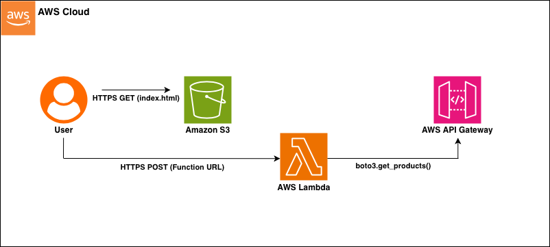

# AWS Serverless Cost Calculator

1. Overview
A serverless web application that estimates AWS costs for EC2 and EBS volumes. It queries the **AWS Pricing API** in real-time to ensure estimates are always accurate, eliminating the need for hardcoded pricing tables.

**Live Demo:** https://cloud-cost-calculator-fezan.s3.eu-west-2.amazonaws.com/index.html

## 2. Architecture & Decisions
* **Frontend:** Hosted on **S3** for 99.99% availability and near-zero cost.
* **Backend:** **AWS Lambda** (Python) via **Function URL**.
    * *Decision:* I chose Function URLs over API Gateway to keep the architecture simple and stay within the Free Tier, as advanced features like throttling weren't required for this MVP.
* **Data Source:** **AWS Pricing API**.
    * *Trade-off:* The Pricing API is only available in `us-east-1`. My Lambda forces a connection to this region regardless of where it is deployed to prevent connection errors.

## 3. Security
* **CORS:** Strictly configured to allow requests *only* from my S3 bucket domain, preventing unauthorized use of my compute resources.
* **Least Privilege:** The Lambda IAM role is scoped strictly to `pricing:GetProducts` and basic logging, with no admin access.
